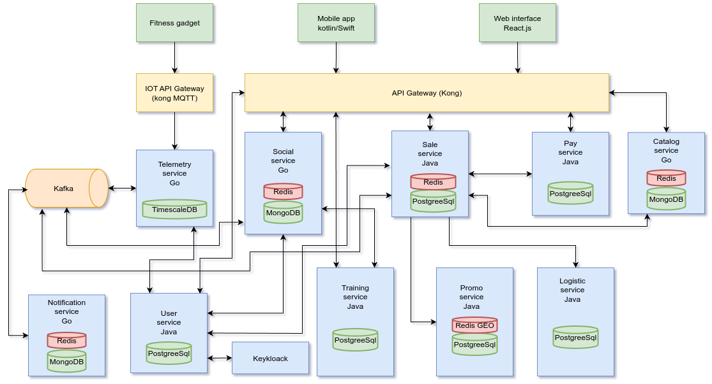

# Артефакт 13: Базовая архитектура системы

- Клиентский слой
  - Мобильные приложения
  - Веб-интерфейс
  - IoT-устройства

- Слой шлюзов
  - API Gateway
  - IoT Gateway
  
- Сервисный слой (микросервисы)
- | Сервис             | Язык | Технологии                        | Назначение                                     |
  |--------------------|------|-----------------------------------|-----------------------------------------------|
  | **User Service**   | Java | Spring Boot, Keycloak, PostgreSQL | Управление пользователями, аутентификация     |
  | **Social Service** | Go   | Gin, MongoDB, Redis,              | Группы, чаты, события                         |
  | **Training Service**| Java | Spring Boot,  PostgreSQL          | Планы тренировок, рекомендации              |
  | **Telemetry Service**| Go   | Kafka, TimescaleDB                | Обработка данных с датчиков                |
  | **Sale Service**   | Java | Spring Boot, Redis, Kafka         | Управление продажами, корзины                 |
  | **Catalog Service**| Go   | Gin, Redis, Mongo                 | Поиск товаров, категории                      |
  | **Promo Service**  | Java | Spring Boot, Redis GEO            | Управление акциями, геотаргетинг              |
  | **Pay Service**    | Java | Spring Boot,  PostgreSQL         | Обработка платежей                            |
  | **Logistic Service**| Java | Spring Boot, Feign Client , PostgreSQL      | Интеграция с службами доставки    |
  | **Notificaton Service**| Go   | Kafka,Redis,Mongo                 | Сервис уведомлений                       |

## Адресация атрибутов качества

1. ### Масштабируемость
- **Горизонтальное масштабирование**:
  - Kubernetes  (автоскейлинг по CPU/RPS)
  - Шардирование БД: PostgreSQL, MongoDB
- **Геораспределение**:
  - Multi-region развертывание в AWS/GCP
- **Обработка пиковых нагрузок**:
  - Kafka-буферизация для IoT-данных
2. ### Безопасность
- **Защита данных**:
  - Шифрование: TLS 1.3, AES-256 
  - Vault для управления секретами
- **Аутентификация**:
  - OAuth 2.0 (Keycloak)
  - Биометрия для мобильных приложений
3. ### Доступность
- **SLA 99.95%**:
  - Kubernetes pod anti-affinity
  - Multi-AZ развертывание
- **Disaster Recovery**:
  - Ежедневные бэкапы в S3
- **Circuit Breaker**:
  - Resilience4j для Java-сервисов
  - Hystrix-like паттерны в Go
4. ### Наблюдаемость
- **Мониторинг**:
  - Prometheus + Grafana 
  - SLA-алертинг
- **Логирование**:
  - ELK-стек 
  - Структурированные логи
- **Трейсинг**:
  - Jaeger для распределенного трейсинга
  - Сквозная идентификация запросов