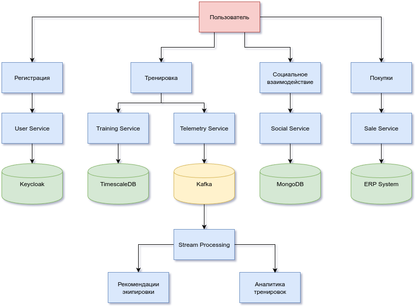
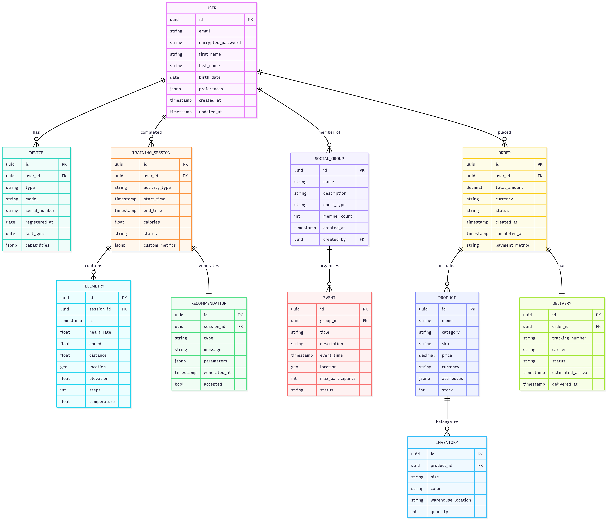
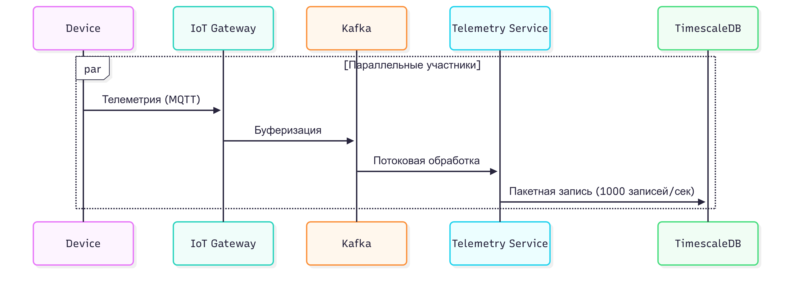
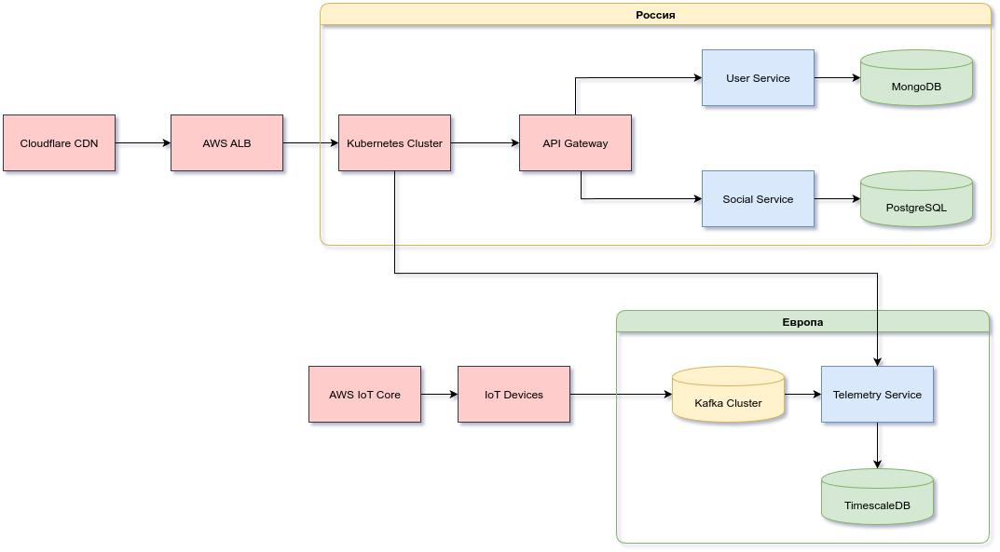
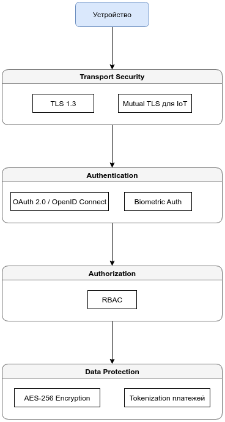

# Основные представления архитектуры.

 -  ## Функциональное представление
 
- **Пользовательские функции:** Регистрация, Тренировки, Соцвзаимодействие, Покупки.
- **Сервисы:** User Service, Training Service, Telemetry Service, Social Service, Sale Service, обрабатывающие логику.
  
- **Инфраструктура:** Keycloak (аутентификация), TimescaleDB/MongoDB (хранение данных), Kafka (потоковая обработка), ERP (интеграция с бизнес-системами).
- **Обработка данных:** Stream Processing для анализа потоков.

- **Бизнес-возможности:** Генерация рекомендаций экипировки и аналитики тренировок на основе данных.
---

 -  ## Информационное представление
 

**Схема описывает реляционную структуру данных, включающую:**

- **Пользователей (USER)** – хранит профили, предпочтения.

- **Устройства (DEVICE)** – связаны с пользователями (фитнес-трекеры и др.).

- **Тренировки (TRAINING_SESSION)** – данные сессий с метриками (TELEMETRY: пульс, скорость и т.д.).

- **Рекомендации (RECOMMENDATION)** – на основе тренировок (подбор экипировки).

- **Соц. функции** – группы (SOCIAL_GROUP) и события (EVENT).

- **Продажи** – заказы (ORDER), товары (PRODUCT), доставка (DELIVERY), склад (INVENTORY).

#### Связи:

- Пользователи владеют устройствами, тренировками, заказами и состоят в группах.

- Тренировки содержат телеметрию и формируют рекомендации.

- Заказы включают товары и связаны с доставкой.

- Товары хранятся на складе.

**Цель:** Поддержка фитнес-трекинга, соц. взаимодействия и онлайн-продаж в единой системе.
 
---
-  ## Представление многозадачности

   **Схема представляет обработку телеметрии в режиме многопоточности:**

   - Устройства (Device) отправляют телеметрию (MQTT) → IoT Gateway (шлюз).

   - Данные буферизуются и передаются в Kafka для потоковой обработки.

   - Параллельная обработка (многопоточность):

     - Telemetry Service читает данные из Kafka, обрабатывает их в реальном времени (Stream Processing).

     - Результаты пакетно записываются в TimescaleDB (1000 записей/сек) для эффективности.

   **Архитектурные особенности:**

   - Масштабируемость: Kafka и многопоточность Telemetry Service обеспечивают обработку высоких нагрузок.

   - Надежность: Буферизация в Kafka предотвращает потерю данных при пиковых нагрузках.

   - Оптимизация: Пакетная запись в БД снижает нагрузку на систему.

   **Цель:** Высокопроизводительный сбор и анализ данных с устройств (например, фитнес-трекеров) с минимальными задержками.

---
 -  ## Инфраструктурное представление

**Описание инфраструктурной схемы:**

### Геораспределённая архитектура

  **Россия (пользовательские сервисы)**

Внешний слой:
- **Cloudflare CDN** - защита и распределение трафика
- **AWS ALB** - балансировка нагрузки

Бэкенд:
- **Kubernetes Cluster** - оркестрация сервисов
- **API Gateway** - единая точка входа
- Микросервисы:
    - **User Service** - управление пользователями
    - **Social Service** - социальные функции
- Хранилище:
    - **PostgreSQL** - реляционные данные

 **Европа (IoT-сервисы)**

Устройства и сбор данных:
- **AWS IoT Core** - управление IoT-устройствами
- **IoT Devices** - конечные устройства

Обработка данных:
- **Kafka Cluster** - потоковая буферизация
- **Telemetry Service** - обработка метрик
- Хранилище:
    - TimescaleDB - временные ряды

Ключевые особенности
- **Геораспределение** - соответствие требованиям к задержкам и регуляториям (GDPR)  
- **Масштабируемость** - Kubernetes + Kafka для гибкой работы под нагрузкой  
- **Специализация** - разделение на пользовательские сервисы и IoT-обработку  
- **Отказоустойчивость** - изолированные компоненты в разных регионах

**Цель:** Высокопроизводительная инфраструктура для поддержки пользователей и IoT-устройств с географической оптимизацией.

---
- ## Представление безопасности

**Описание схемы безопасности**
- **Транспортная безопасность**

 - -  **TLS 1.3** - основной протокол защиты трафика
 - -  **Mutual TLS (mTLS)** - для аутентификации IoT-устройств

 **Аутентификация**

| Метод | Описание |
|-------|----------|
| **OAuth 2.0 / OpenID Connect** | Стандартная аутентификация пользователей |
| **Biometric Auth** | Биометрическая аутентификация |

**Авторизация и защита данных**
- **RBAC** (Role-Based Access Control) - управление правами доступа
- **Data Protection** - защита данных

| Метод защиты | Применение |
|-------------|------------|
| **AES-256 Encryption** | Шифрование данных |
| **Tokenization платежей** | Защита платёжных данных |

**Ключевые особенности:**
- Многоуровневая защита (транспортная, аутентификация, авторизация)
- Поддержка современных стандартов (TLS 1.3, OAuth 2.0)
- Специальные меры для IoT (mTLS) и платежей (токенизация)
